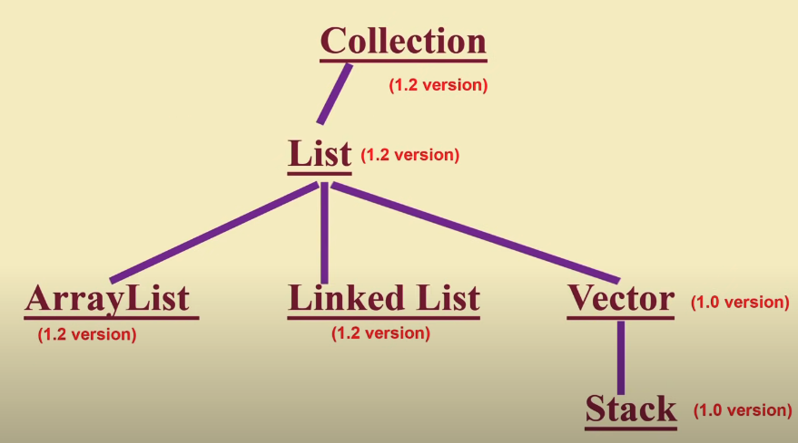
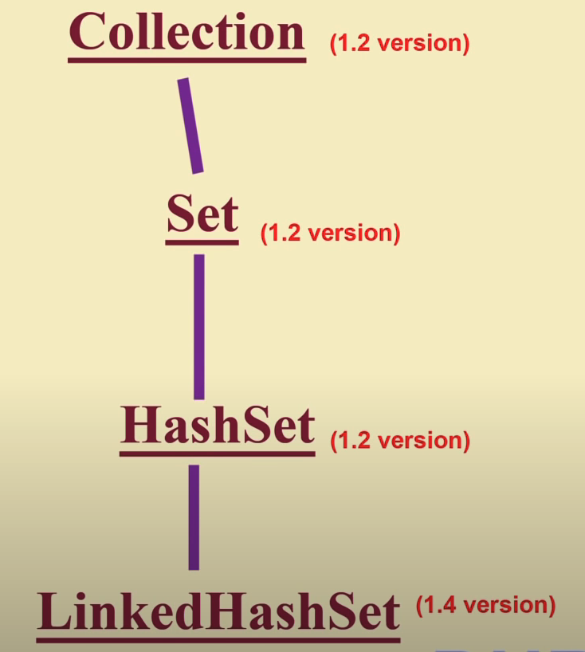
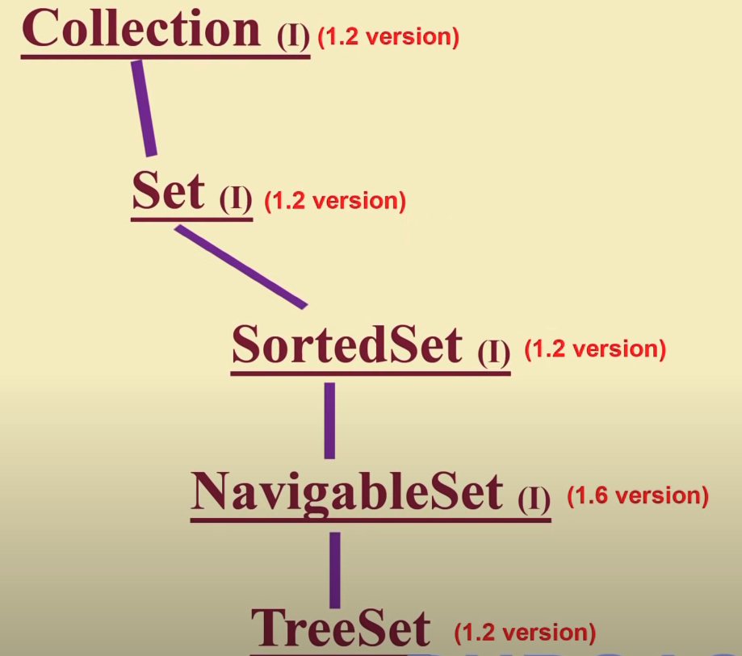
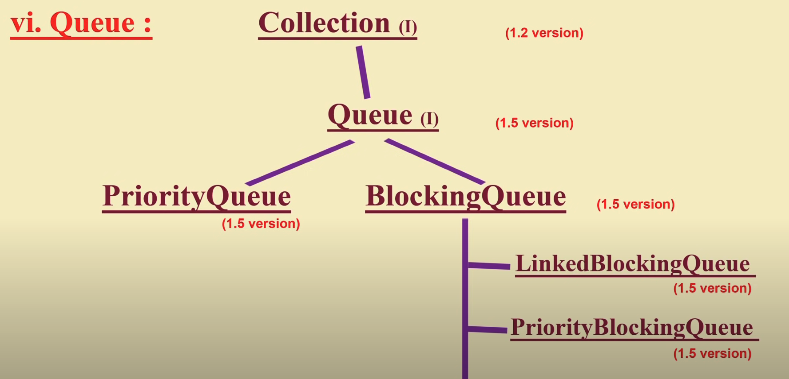
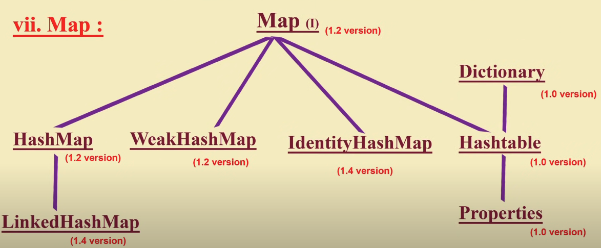
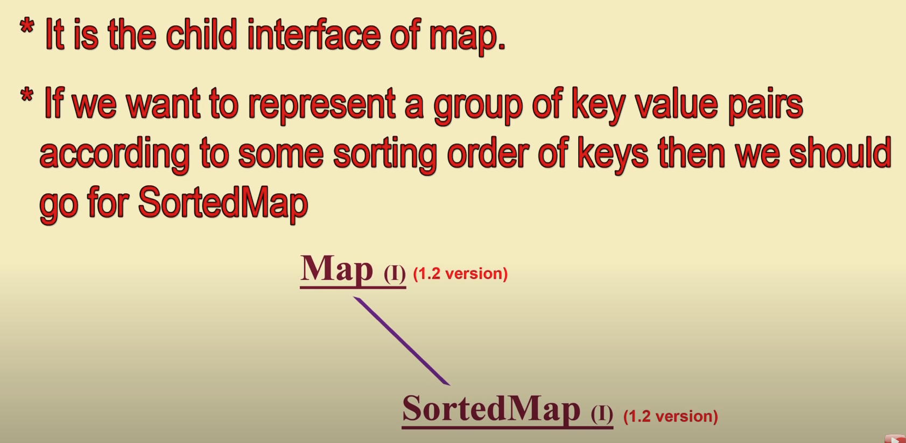
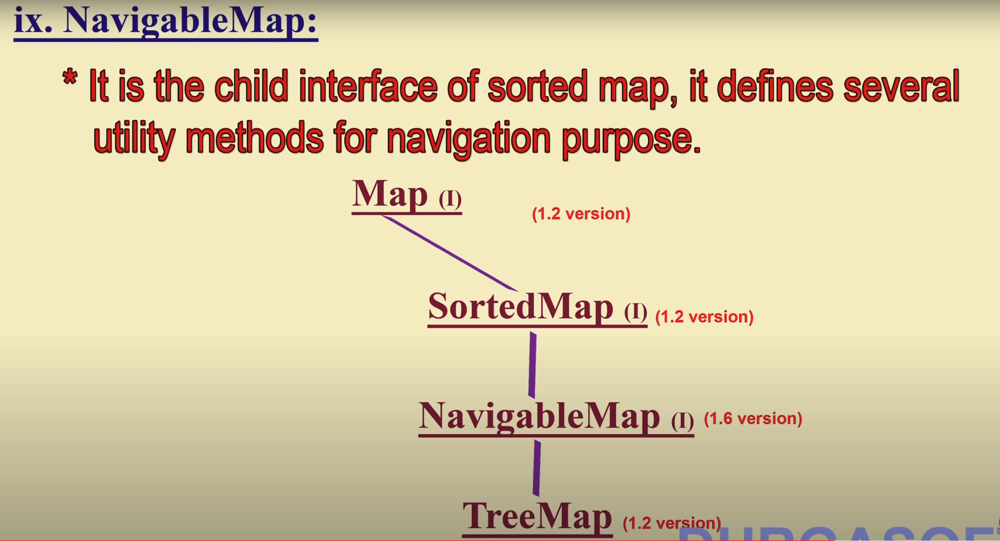
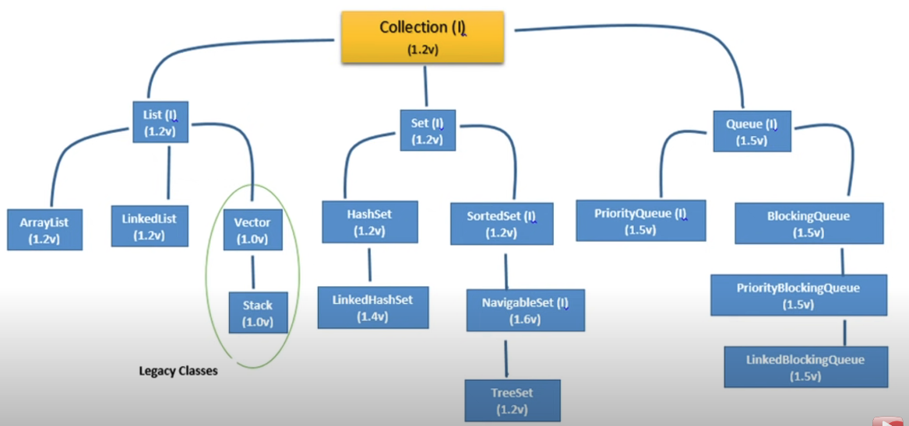

# CollectionsFramework

##### Overview :
- Arrays : 
    * The biggest advantage of arrays is, we can represent huge data set using one variable.
    * Readability of code increase, as we don't have to individually represent the data.
    * Arrays are fixed in size, once created, there is no chance of increasing/decreasing its size.
    * Arrays can hold only homogeneous data elements.
    * Arrays concept is not implemented based on some standard data structure.
    * Readymade method support for arrays we can't expect.

```
Student[] students = new Student[10];
students[0] = new Student();
// incompatible type found, homogeneous data element is required.
students[1] = new Customer();

// valid data elements
Object[] objects = new Object[10];
objects[0] = new Student();
objects[1] = new Customer();
```

##### Collections :
- Collections are growable in nature. (We can overcome the problem of increasing/decreasing the capacity of array).
- Collections can hold both homogeneous & heterogeneous objects.
- Every collection class is based on some standard data structure.
- Readymade method support is available, hence we don't have to explicitly write implementations.


##### Difference between Arrays & Collections :
- Arrays are fixed in size.
- Collections are growable in nature.

- Arrays are not great w.r.t to memory, allocating more memory locations is not possible.
- Collections have that support of increasing memory support for additional data elements.

- w.r.t performance, arrays are recommended.
- w.r.t performance, collections are not recommended.

- Arrays can hold only homogeneous elements.
- Collections can hold both.

- Since Arrays concept is not based on some standard D.S, underlying D.S support is not available, readymade method support is also not available.
- For every collection, readymade method support is available.

- By using arrays, we can use primitives & non-primitives array types.
- By using collections, we can hold only objects but not primitives.

```
int[] array = new int[100];
Integer[] array = new Integer[100];

List<Integer> bag = new ArrayList();
List<int> bag = new ArrayList(); // not allowed
```

- Note : the above explaination is valid for :
    * Arrays vs ArrayList
    * Arrays vs Vector  
    * Arrays vs TreeSet and so on...

##### Collection & Collections Framework :
- Collection is a group of individual objects as single entity.
- Collections Framework defines several classes & interfaces which can be used to represent collection.
- Collection interface defines the most common methods which are applicable for any Collection object.
- In general, collection interface is considered as root interface of Collection Framework.
- Note : There is no concrete class which implements Collection Interface directly.

##### Difference between Collection & Collections :
- Collection is an interface, Collections is a bunch of classes.
- When we want to represent individual objects as single entity, we use Collection. Whereas Collections is a utility class, which defines bunch of methods to interact with Collection and defines utility methods for Searching, Sorting etc.

##### Interfaces & Heirarchy :
- Collection, List, ArrayList, LinkedList came in Java V1.2.
- Vector, Stack came in Java V1.0, and so they are legacy classes.



- Set, HashSet, LinkedHashSet.



##### Differences between List & Set :
- List : Duplicates are allowed.
- Set : Duplicates are not allowed.

- List : Insertion order is preserved.
- Set : Insertion order is not preserved.

##### SortedSet, NavigableSet : 
- SortedSet : It we want to treat individual objects as single entity where duplicates are not allowed but all objects should be inserted according to some sorting order then we should go for SortedSet.
- NavigableSet (Child interface of SortedSet) :
    * It defines certain methods for navigation purpose.
    * For example : nextElement, previousElement.
    * TreeSet is the implementation class of NavigableSet.



##### Queue :
- Queue comes from Collection interface.
- Its child interfaces are :
    * PriorityQueue
    * BlockingQueue (interface) :
        * LinkedBlockingQueue
        * PriorityBlockingQueue



- Note : All the above interfaces are meant for representing a group of individual objects. If we want to represent a group of objects as key-value pairs, then we should go for Map Interface.

##### Map :







##### Overview of Collections Framework (Entirely):


- Sorting
    * Comparable
    * Comparator
- Cursors
    * Enumeration
    * Iterator
    * ListIterator
- Utility classes
    * Collections
    * Arrays

* Note : List out all the key differences between various implementations.



#### Implementation Details :
- Collection Interface methods :

```
// Adds the specified element to the collection if it's not already present.
boolean add(E e)

// Adds all of the elements in the specified collection to this collection.
boolean addAll(Collection<? extends E> c)

// Removes all of the elements from this collection.
void clear() 

// Returns true if this collection contains the specified element.
boolean contains(Object o) 

// Returns true if this collection contains all of the elements in the specified collection.
boolean containsAll(Collection<?> c) 

// Compares the specified object with this collection for equality.
boolean equals(Object o) 

// Returns the hash code value for this collection.
int hashCode() 

// Returns true if this collection contains no elements.
boolean isEmpty() 

// Returns an iterator over the elements in this collection.
Iterator<E> iterator() 

// Removes a single instance of the specified element from this collection, if it is present.
boolean remove(Object o)

// Removes all of this collection's elements that are also contained in the specified collection.
boolean removeAll(Collection<?> c) 

// Retains only the elements in this collection that are contained in the specified collection.
boolean retainAll(Collection<?> c)

// Returns the number of elements in this collection.
int size()

// Returns an array containing all of the elements in this collection.
Object[] toArray()

// Returns an array containing all of the elements in this collection; the runtime type of the returned array is that of the specified array.   
<T> T[] toArray(T[] a)
```

- List Interface Methods :

```
// Inserts the specified element at the specified position in this list.
void add(int index, E element)

// Inserts all of the elements in the specified collection into this list at the specified position.
boolean addAll(int index, Collection<? extends E> c)

// Returns the element at the specified position in this list.
E get(int index) 

// Returns the index of the first occurrence of the specified element in this list, or -1 if this list does not contain the element.
int indexOf(Object o) 

// Returns the index of the last occurrence of the specified element in this list, or -1 if this list does not contain the element.
int lastIndexOf(Object o)

// Returns a list iterator over the elements in this list (in proper sequence).
ListIterator<E> listIterator() 

// Returns a list iterator over the elements in this list (in proper sequence), starting at the specified position in the list.
ListIterator<E> listIterator(int index) 

// Removes the element at the specified position in this list.
E remove(int index)

// Replaces the element at the specified position in this list with the specified element.
E set(int index, E element)

// Returns a view of the portion of this list between the specified fromIndex, inclusive, and toIndex, exclusive.
List<E> subList(int fromIndex, int toIndex)
```

- ArrayList Class Methods (Other than List Interface) :

```
// Trims the capacity of this ArrayList instance to be the list's current size. This is useful when you want to minimize the storage overhead of the ArrayList instance.
void trimToSize()

// Increases the capacity of this ArrayList instance, if necessary, to ensure that it can hold at least the number of elements specified by the minCapacity argument.
void ensureCapacity(int minCapacity)

// Performs the given action for each element of the ArrayList until all elements have been processed or the action throws an exception.
void forEach(Consumer<? super E> action)

// Replaces each element of this ArrayList with the result of applying the given operator to the element.
void replaceAll(UnaryOperator<E> operator)

// Sorts this ArrayList according to the order induced by the specified comparator.
void sort(Comparator<? super E> c)

// Removes all of the elements of this ArrayList that satisfy the given predicate.
boolean removeIf(Predicate<? super E> filter)

// Creates a late-binding and fail-fast Spliterator over the elements in this ArrayList.
Spliterator<E> spliterator()
```

- Default capacity of ArrayList is 10.
- New capacity formula is : newCapacity = (currentCapacity * 3/2) + 1;

- Note : 
    * Every collection class implements Serializable & Cloneable interface.
    * ArrayList & Vector classes implements RandomAccess interface (Marker Interface).
