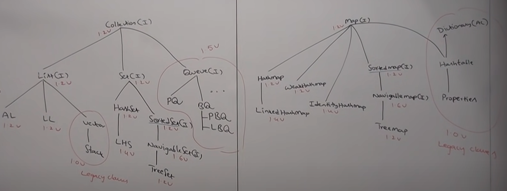

# CollectionsFramework

##### Overview :
- Arrays : 
    * The biggest advantage of arrays is, we can represent huge data set using one variable.
    * Readability of code increase, as we don't have to individually represent the data.
    * Arrays are fixed in size, once created, there is no chance of increasing/decreasing its size.
    * Arrays can hold only homogeneous data elements.
    * Arrays concept is not implemented based on some standard data structure.
    * Readymade method support for arrays we can't expect.

```
Student[] students = new Student[10];
students[0] = new Student();
// incompatible type found, homogeneous data element is required.
students[1] = new Customer();

// valid data elements
Object[] objects = new Object[10];
objects[0] = new Student();
objects[1] = new Customer();
```

##### Collections :
- Collections are growable in nature. (We can overcome the problem of increasing/decreasing the capacity of array).
- Collections can hold both homogeneous & heterogeneous objects.
- Every collection class is based on some standard data structure.
- Readymade method support is available, hence we don't have to explicitly write implementations.


##### Difference between Arrays & Collections :
- Arrays are fixed in size.
- Collections are growable in nature.

- Arrays are not great w.r.t to memory, allocating more memory locations is not possible.
- Collections have that support of increasing memory support for additional data elements.

- w.r.t performance, arrays are recommended.
- w.r.t performance, collections are not recommended.

- Arrays can hold only homogeneous elements.
- Collections can hold both.

- Since Arrays concept is not based on some standard D.S, underlying D.S support is not available, readymade method support is also not available.
- For every collection, readymade method support is available.

- By using arrays, we can use primitives & non-primitives array types.
- By using collections, we can hold only objects but not primitives.

```
int[] array = new int[100];
Integer[] array = new Integer[100];

List<Integer> bag = new ArrayList();
List<int> bag = new ArrayList(); // not allowed
```

- Note : the above explaination is valid for :
    * Arrays vs ArrayList
    * Arrays vs Vector  
    * Arrays vs TreeSet and so on...

##### Collection & Collections Framework :
- Collection is a group of individual objects as single entity.
- Collections Framework defines several classes & interfaces which can be used to represent collection.
- Collection interface defines the most common methods which are applicable for any Collection object.
- In general, collection interface is considered as root interface of Collection Framework.
- Note : There is no concrete class which implements Collection Interface directly.

##### Difference between Collection & Collections :
- Collection is an interface, Collections is a bunch of classes.
- When we want to represent individual objects as single entity, we use Collection. Whereas Collections is a utility class, which defines bunch of methods to interact with Collection and defines utility methods for Searching, Sorting etc.

##### Interfaces & Heirarchy :
- Collection, List, ArrayList, LinkedList came in Java V1.2.
- Vector, Stack came in Java V1.0, and so they are legacy classes.


- Set, HashSet, LinkedHashSet.


##### Differences between List & Set :
- List : Duplicates are allowed.
- Set : Duplicates are not allowed.

- List : Insertion order is preserved.
- Set : Insertion order is not preserved.

##### SortedSet, NavigableSet : 
- SortedSet : It we want to treat individual objects as single entity where duplicates are not allowed but all objects should be inserted according to some sorting order then we should go for SortedSet.
- NavigableSet (Child interface of SortedSet) :
    * It defines certain methods for navigation purpose.
    * For example : nextElement, previousElement.
    * TreeSet is the implementation class of NavigableSet.


##### Queue :
- Queue comes from Collection interface.
- Its child interfaces are :
    * PriorityQueue
    * BlockingQueue (interface) :
        * LinkedBlockingQueue
        * PriorityBlockingQueue


- Note : All the above interfaces are meant for representing a group of individual objects. If we want to represent a group of objects as key-value pairs, then we should go for Map Interface.

##### Map :


##### Overview of Collections Framework (Entirely):



- Sorting
    * Comparable
    * Comparator
- Cursors
    * Enumeration
    * Iterator
    * ListIterator
- Utility classes
    * Collections
    * Arrays

* Note : List out all the key differences between various implementations.


#### Implementation Details :
- Collection Interface methods :

```
// Adds the specified element to the collection if it's not already present.
boolean add(E e)

// Adds all of the elements in the specified collection to this collection.
boolean addAll(Collection<? extends E> c)

// Removes all of the elements from this collection.
void clear() 

// Returns true if this collection contains the specified element.
boolean contains(Object o) 

// Returns true if this collection contains all of the elements in the specified collection.
boolean containsAll(Collection<?> c) 

// Compares the specified object with this collection for equality.
boolean equals(Object o) 

// Returns the hash code value for this collection.
int hashCode() 

// Returns true if this collection contains no elements.
boolean isEmpty() 

// Returns an iterator over the elements in this collection.
Iterator<E> iterator() 

// Removes a single instance of the specified element from this collection, if it is present.
boolean remove(Object o)

// Removes all of this collection's elements that are also contained in the specified collection.
boolean removeAll(Collection<?> c) 

// Retains only the elements in this collection that are contained in the specified collection.
boolean retainAll(Collection<?> c)

// Returns the number of elements in this collection.
int size()

// Returns an array containing all of the elements in this collection.
Object[] toArray()

// Returns an array containing all of the elements in this collection; the runtime type of the returned array is that of the specified array.   
<T> T[] toArray(T[] a)
```

- List Interface Methods :

```
// Inserts the specified element at the specified position in this list.
void add(int index, E element)

// Inserts all of the elements in the specified collection into this list at the specified position.
boolean addAll(int index, Collection<? extends E> c)

// Returns the element at the specified position in this list.
E get(int index) 

// Returns the index of the first occurrence of the specified element in this list, or -1 if this list does not contain the element.
int indexOf(Object o) 

// Returns the index of the last occurrence of the specified element in this list, or -1 if this list does not contain the element.
int lastIndexOf(Object o)

// Returns a list iterator over the elements in this list (in proper sequence).
ListIterator<E> listIterator() 

// Returns a list iterator over the elements in this list (in proper sequence), starting at the specified position in the list.
ListIterator<E> listIterator(int index) 

// Removes the element at the specified position in this list.
E remove(int index)

// Replaces the element at the specified position in this list with the specified element.
E set(int index, E element)

// Returns a view of the portion of this list between the specified fromIndex, inclusive, and toIndex, exclusive.
List<E> subList(int fromIndex, int toIndex)
```

- ArrayList Class Methods (Other than List Interface) :

```
// Trims the capacity of this ArrayList instance to be the list's current size. This is useful when you want to minimize the storage overhead of the ArrayList instance.
void trimToSize()

// Increases the capacity of this ArrayList instance, if necessary, to ensure that it can hold at least the number of elements specified by the minCapacity argument.
void ensureCapacity(int minCapacity)

// Performs the given action for each element of the ArrayList until all elements have been processed or the action throws an exception.
void forEach(Consumer<? super E> action)

// Replaces each element of this ArrayList with the result of applying the given operator to the element.
void replaceAll(UnaryOperator<E> operator)

// Sorts this ArrayList according to the order induced by the specified comparator.
void sort(Comparator<? super E> c)

// Removes all of the elements of this ArrayList that satisfy the given predicate.
boolean removeIf(Predicate<? super E> filter)

// Creates a late-binding and fail-fast Spliterator over the elements in this ArrayList.
Spliterator<E> spliterator()
```

- Default capacity of ArrayList is 10.
- New capacity formula is : newCapacity = (currentCapacity * 3/2) + 1;

- Note : 
    * Every collection class implements Serializable & Cloneable interface.
    * ArrayList & Vector classes implements RandomAccess interface (Marker Interface).

```
ArrayList arrayList = new ArrayList();
LinkedList linkedList = new LinkedList();

System.out.println(arrayList instanceOf Serializable); // true
System.out.println(linkedList instanceOf Cloneable); // true

System.out.println(arrayList instanceof RandomAccess); // true
System.out.println(linkedList instanceOf RandomAccess); // false
```
- ArrayList is the best choice if our most frequent operation is retrieval operation. (Because it implements RandomAccess interface).
- ArrayList is the worst choice if our most frequent operation is insertion/deletion in the middle. (Because several shift operations are required).

#### Difference between ArrayList and Vector :
- ArrayList : Every method present is non-synchronized. 
- Vector : Every method present is synchronized.

- ArrayList : Thread Safety is an issue.
- Vector : Thread Safe.

- ArrayList : Performance is relatively high.
- Vector : Because of thread safety, some of the threads may have to wait in order to complete the tasks, thus low in performance.

- ArrayList : Introduced in version 1.2 - non-legacy.
- Vector : Introduced in version 1.0 - legacy (an old generation implementation).

- ArrayList : Size grows using formula - (currentCapacity * (3/2)) + 1;
- Vector : Size grows by doubling the current capacity - (currentCapacity * 2).

#### Synchronized version of ArrayList :

```
ArrayList arrayList = new ArrayList(); // non-synchronized
List list = Collections.synchronizedList(arrayList); // synchronized
```

- The synchronization wrappers add automatic synchronization (thread-safety) to an arbitrary collection. Each of the six core collection interfaces — Collection, Set, List, Map, SortedSet, and SortedMap — has one static factory method.

```
public static <T> Collection<T> synchronizedCollection(Collection<T> c);
public static <T> Set<T> synchronizedSet(Set<T> s);
public static <T> List<T> synchronizedList(List<T> list);
public static <K,V> Map<K,V> synchronizedMap(Map<K,V> m);
public static <T> SortedSet<T> synchronizedSortedSet(SortedSet<T> s);
public static <K,V> SortedMap<K,V> synchronizedSortedMap(SortedMap<K,V> m);
```

- Each of these methods returns a synchronized (thread-safe) Collection backed up by the specified collection. To guarantee serial access.

#### LinkedList Details & Implementation :
- The underlying d.s in LinkedList class is DoublyLinkedList.
- Insertion order is preserved.
- Duplicates are allowed.
- Heterogeneous objects are allowed.
- Null insertion is possible.

```
// Methods
void addFirst(E element);
void addLast(E element);

Object getFirst();
Object getLast();

Object removeFirst();
Object removeLast();

// Constructors
LinkedList linkedList = new LinkedList();
LinkedList linkedList = new LinkedList(Collection collection);
```

#### Difference between ArrayList & LinkedList :
- ArrayList : Best for retrieval operations.
- LinkedList : Best for insertion/deletion operations in the middle.

- ArrayList : Worst for insertion/deletion operations in the middle. (As there are several shift operations required).
- LinkedList : Worst for retrieval operation. (As iteration starts from the first node).

- ArrayList : The underlying d.s is resizable & growable array.
- LinkedList : Doubly Linked List is the underlying d.s.

- ArrayList : Implements RandomAccess.
- LinkedList : Doesn't implements RandomAccess.


#### Vector :
- Underlying D.S is resizable or growable array.
- Duplicates are allowed.
- Insertion order is preserved.
- Null insertion is possible.
- Heterogeneous objects are allowed. (Except : TreeSet and TreeMap)
- Implements Serializable, Cloneable, RandomAcess interfaces.
- All the methods are synchronized.

```
        // Creating a Vector
        Vector<Integer> vector = new Vector<>();

        // Adding elements to the Vector
        vector.add(1);
        vector.add(2);
        vector.add(3);

        // Method: addElement(E obj)
        vector.addElement(4);

        // Method: capacity()
        int capacity = vector.capacity();

        // Method: clone()
        Vector<Integer> clonedVector = (Vector<Integer>) vector.clone();

        // Method: contains(Object elem)
        boolean containsElement = vector.contains(2);

        // Method: copyInto(Object[] anArray)
        Integer[] newArray = new Integer[vector.size()];
        vector.copyInto(newArray);

        // Method: elementAt(int index)
        int elementAtIndex = vector.elementAt(2);

        // Method: elements()
        // Returns an enumeration of the components of this vector.

        // Method: ensureCapacity(int minCapacity)
        vector.ensureCapacity(20);

        // Method: firstElement()
        int firstElement = vector.firstElement();

        // Method: get(int index)
        int element = vector.get(1);

        // Method: indexOf(Object elem)
        int indexOfElement = vector.indexOf(3);

        // Method: indexOf(Object elem, int index)
        int indexOfElementFromIndex = vector.indexOf(2, 1);

        // Method: insertElementAt(E obj, int index)
        vector.insertElementAt(5, 2);

        // Method: isEmpty()
        boolean isEmpty = vector.isEmpty();

        // Method: lastElement()
        int lastElement = vector.lastElement();

        // Method: lastIndexOf(Object elem)
        int lastIndexOfElement = vector.lastIndexOf(2);

        // Method: lastIndexOf(Object elem, int index)
        int lastIndexOfElementFromIndex = vector.lastIndexOf(2, 1);

        // Method: remove(int index)
        vector.remove(2);

        // Method: removeElement(Object obj)
        vector.removeElement(4);

        // Method: removeElementAt(int index)
        vector.removeElementAt(1);

        // Method: removeAllElements()
        vector.removeAllElements();

        // Method: removeIf(Predicate<? super E> filter)
        // Removes all elements of this vector that satisfy the given predicate.

        // Method: retainAll(Collection<?> c)
        // Retains only the elements in this vector that are contained in the specified collection.

        // Method: set(int index, E element)
        vector.set(0, 10);

        // Method: setSize(int newSize)
        vector.setSize(5);

        // Method: size()
        int size = vector.size();

        // Method: subList(int fromIndex, int toIndex)
        // Returns a view of the portion of this vector between the specified fromIndex, inclusive, and toIndex, exclusive.

        // Method: toArray()
        Object[] array = vector.toArray();

        // Method: toArray(T[] a)
        Integer[] newArray2 = vector.toArray(new Integer[0]);

        // Method: toString()
        String vectorAsString = vector.toString();

        // Constructors
        Vector vector = new Vector();
        Vector vector = new Vector(int initialCapacity);
        Vector vector = new Vector(int initialCapacity, int incrementalCapacity);
        Vector vector = new Vector(Collection collection);
```

#### Stack :

```
Object push(Object object);
Object pop();
Object peek();
int search(Object object);
```

#### Cursors :
- To retrieve elements from the Collection one by one, we use cursors.

```
1. Enumeration
2. Iterator
3. ListIterator
```

- Enumeration :

```
// To get an enumeration for any collection
public Enumeration elements();

Example :
Enumeration enumeration = vector.elements();

Methods :
1. public boolean hasMoreElements();
2. public Object nextElement();

Code Snippet :

Vector<Integer> vector = new Vector();
for (int index = 0; index < 10; index++) {
	vector.add(index * 10);
}
		
Enumeration<Integer> enumeration = vector.elements();
while (enumeration.hasMoreElements()) {
	System.out.println((Integer) enumeration.nextElement());
}
```
* Issue - Enumeration is applicable only for legacy classes.

- Iterator : 
    * With iterators, we can apply read/remove operations.
    * It is a universal cursor and can be applied on any collection object.

```
// To get the iterator for any collection object
public Iterator iterator();

Example :
Iterator iterator = list.iterator();

Methods :
public boolean hasNext();
public Object next();
public void remove();

Code Snippet :

List<Integer> list = new ArrayList();
for (int index = 0; index < 10; index++) {
	list.add(index * 10);
}
		
Iterator iterator = (Iterator) list.iterator();
while (iterator.hasNext()) {
	System.out.println(iterator.next());
}
```
- Limitations of Iterator :
    * Enumeration & Iterator always moves forward.
    * These are single direction cursors.
    * We can only perform - read & remove operations.

- ListIterator :
    * The most powerful cursor.
    * A bi-directional cursor.
    * We can perform - Remove, Read, Replacement, Addition operations.
    * It comes from Iterator interface.

```
public ListIterator listIterator();
Example : ListIterator lIterator = collection.listIterator();

Methods :

// Forward
- public boolean hasNext();
- public Object next();
- public int nextIndex();

// Backward
- public boolean hasPrevious();
- public Object previous();
- public int previousIndex();

// Removal
- public void remove();

// Replace
- public void set(Object newObject);

// Addition
- public void add(Object newObject);
```

#### Comparison between three cursors :


#### Set :

- HashSet :
    * Underlying d.s is hashtable.
    * Duplicates are not allowed. (add method returns false).
    * All objects are inserted based on their hashCodes, hence order is not preserved.
    * Heterogeneous objects are allowed.
    * Null object is allowed.
    * Serializable & Cloneable implementation.
    * Search/Retrieve operation is easy. [O(1) time complexity]

```
// Constructors

// Default Capacity - 16, Fill Ratio - 0.75
// Fill Ratio is also known as Load Factor.
// Means, after 0.75% is filled, a new object is created for hashSet.
HashSet hashSet = new HashSet(); 

HashSet hashSet = new HashSet(int initialCapacity);

HashSet hashSet = new HashSet(int initialCapacity, float loadFactor);

HashSet hashSet = new HashSet(Collection collection);
```

- Hashtable, LinkedHashSet:


* Don't want duplicates, and ordering should be preserved, then LinkedHashSet is a go to data structure.

- SortedSet :
    * Child interface of set.
    * It we want to group a set of individual objects according to some sorting order and duplicates are not allowed then we should go for sorted set.

```
// Methods
Object first();
Object last();

SortedSet headSet(Object object);
SortedSet tailSet(Object object);
SortedSet subSet(Object one, Object two);

Comparator comparator();
```


#### TreeSet :
- The underlying D.S is balanced tree.
- Duplicate objects are not allowed.
- Insertion order is not preserved, but all elements are inserted according to some sorting order.
- Heterogeneous objects are not allowed. ClassCastException would be thrown.
- Null insertion is allowed, but only once.

```
// Constructors
TreeSet treeSet = new TreeSet(); // natural order sorting
TreeSet treeSet = new TreeSet(Comparator comparator); // define custom comparator
TreeSet treeSet = new TreeSet(Collection collection);
TreeSet treeSet = new TreeSet(SortedSet sortedSet);

// Examples
TreeSet treeSet = new TreeSet();
treeSet.add(new StringBuffer("A"));
treeSet.add(new StringBuffer("Z"));
treeSet.add(new StringBuffer("L"));
treeSet.add(new StringBuffer("B"));

System.out.println(treeSet); // ClassCastException
// Note : If we are depending on natural ordering then objects should be homogeneous
// and comparable (StringBuffer doesn't implements Comparable interface).
// String class and all its wrapper classes implements Comparable interface.
```

#### Comparable Interface :
- It comes from java.lang package.
- It contains only one method - compareTo().

```
// Method
public int compareTo(Object otherObject);

// Example
int result = objectOne.compareTo(objectTwo);
if (result < 0) // objectOne will come before objectTwo
else if (result == 0) // objectOne and objectTwo are equal
else // objectOne will come after objectTwo
```

* Note : If we are depending on default natural ordering, internally JVM will call compareTo() method while inserting objects in TreeSet. Hence, the objects should be Comparable.

#### Comparator Interface :
- We use Comparator to define our custom sorting criteria (Customized Sorting).
- Comparator Interface is present in java.util package.
- If we are not satisfied with the predefined sorting ordering like String class, then we use Comparator.
- It defines two methods :
    ```
    public int compare(Object one, Object two);
    int result = comparator.compare(one, two);
    if (result < 0) // objectOne will come before objectTwo
    else if (result == 0) // objectOne and objectTwo are equal
    else // objectOne will come after objectTwo

    public boolean equals();
    ```

* Note : If we are defining our own Comparator, the objects need not to be Comparable.


#### Difference between Comparable & Comparator :


#### Comparison of Set implemented classes :

